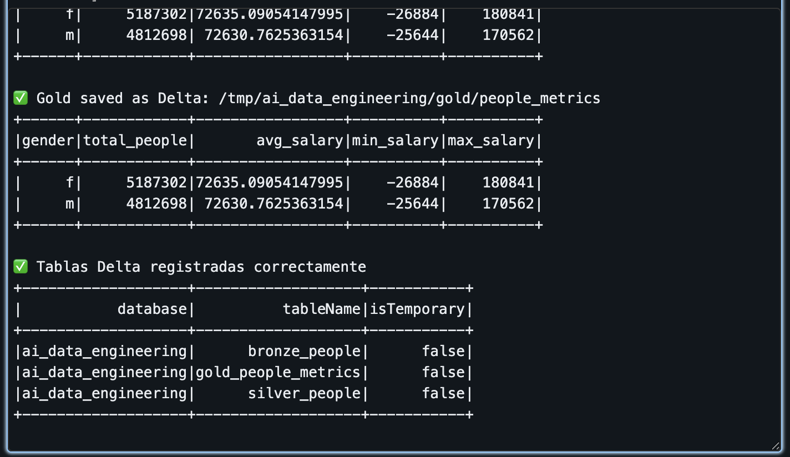
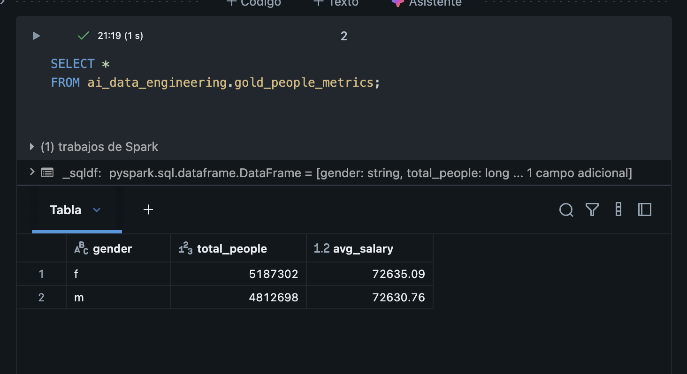

## Overview

This project demonstrates a production-style Data Engineering pipeline implemented in Azure Databricks using Apache Spark (PySpark) and Delta Lake.

The pipeline follows the Bronze / Silver / Gold architecture and was executed and validated in a real Azure Databricks environment.

---

## Data Engineering Capabilities

- Apache Spark (PySpark)
- Delta Lake (ACID-compliant tables)
- Bronze / Silver / Gold modeling
- Data cleansing and standardization
- PII removal and governance
- Business aggregations
- SQL analytics over Delta tables

---

## Pipeline Architecture

Raw Parquet Dataset  
→ Bronze (Delta)  
→ Silver (Cleaned & Anonymized)  
→ Gold (Business Metrics)  
→ SQL Analytics

---

## Bronze Layer

- Raw ingestion from Parquet  
- Stored as Delta Lake  
- Full schema preserved including PII  

---

## Silver Layer

- Data cleansing  
- Lowercasing and trimming  
- PII removal (SSN)  
- Data quality enforcement  

---

## Gold Layer

- Aggregated business metrics  
- Optimized for analytics  
- Queryable via SQL  

---

## Gold Metrics

- Total people by gender  
- Average salary  
- Minimum salary  
- Maximum salary  

---

## Example SQL

SELECT
  gender,
  total_people,
  ROUND(avg_salary, 2) AS avg_salary
FROM ai_data_engineering.gold_people_metrics;

---

## Execution Evidence

The following screenshots demonstrate the successful execution of the end-to-end **Bronze / Silver / Gold Data Engineering pipeline** in **Azure Databricks**.

The evidence confirms that the pipeline was executed in a real environment and not as a conceptual or mock implementation.

### 1. Gold Layer Creation and Metrics Persistence

The Gold layer was successfully generated and saved as a Delta table, containing aggregated business metrics optimized for analytics.

---

### 2. Delta Tables Registration (Bronze / Silver / Gold)

All pipeline layers were registered correctly as Delta tables within the `ai_data_engineering` database.

---

### 3. SQL Analytics over Gold Layer

Business metrics were queried successfully using SQL over the Gold Delta table, validating analytical consumption.

 

---

## Technologies

- Azure Databricks  
- Apache Spark  
- Delta Lake  
- SQL  
- Azure Cloud  

---

## Status

✔ Azure Databricks configured  
✔ Bronze / Silver / Gold implemented  
✔ Delta tables registered  
✔ SQL validated  

---

## License

MIT License

